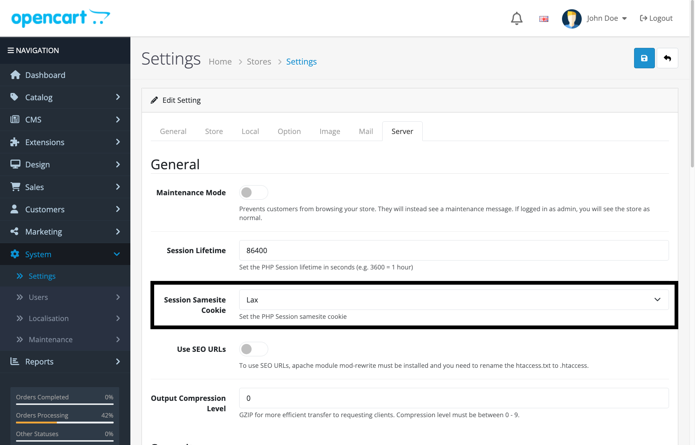

# CHIP for OpenCart 4.1.x

This module adds CHIP payment method option to your OpenCart 4.1.x.

## Installation

* [Download zip file of OpenCart plugin](https://download-directory.github.io/?url=https%3A%2F%2Fgithub.com%2FCHIPAsia%2Fchip-for-opencart%2Ftree%2Fmain%2F4.1).
* Rename the downloaded zip file to *chip.ocmod.zip*
* Upload to the Extension Installer and Install
* Navigate to : **Extensions** -> **Payments**
* Click **Install**, for CHIP Payment Gateway.

## Configuration

Set the **Brand ID** and **Secret Key** in the plugins settings.

### Important Requirement

**Session SameSite Cookie Setting**: For the CHIP payment integration to work properly, merchants need to set the session samesite cookie to **Lax** instead of **Strict**. 

To configure this setting:
1. Navigate to **OpenCart Admin >> System >> Settings >> Stores >> Server**
2. Set the **Session SameSite Cookie** to **Lax**

This setting is required for the payment gateway redirects and callbacks to function correctly.

## Other

Facebook: [Merchants & DEV Community](https://www.facebook.com/groups/3210496372558088)
